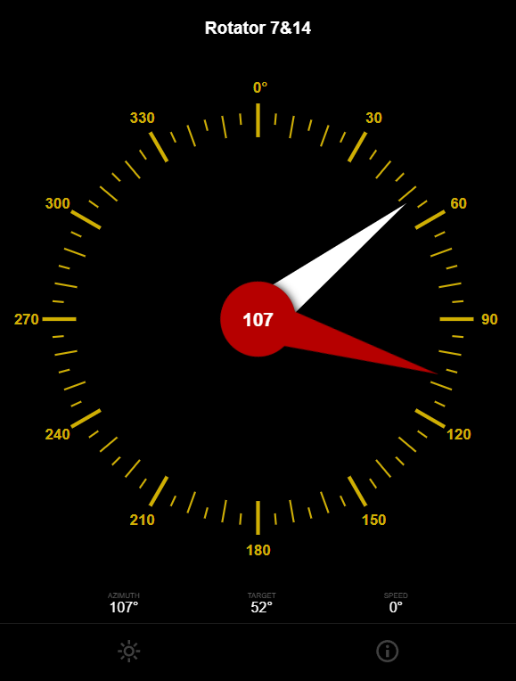

# Rotator
**Simple** antenna rotator for amateur radio use. 
Designed for Radioclub Omega ([OM3KFF](https://www.om3kff.sk))

### GUI

> [!CAUTION]
> Before using with a rotator, make sure that `DEBUG` flag is commented out in [platformio.ini](RotatorFW/platformio.ini). This disables all Serial.* because they are blocking on ESP32 C3.
